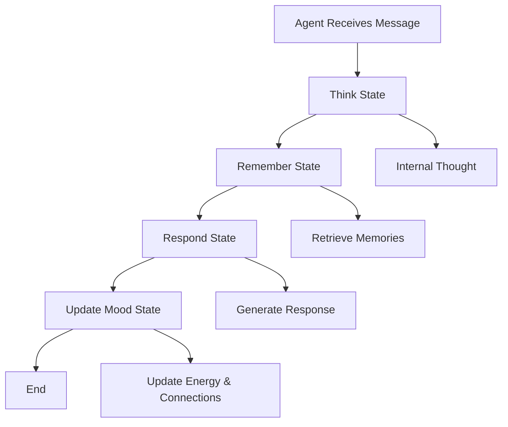
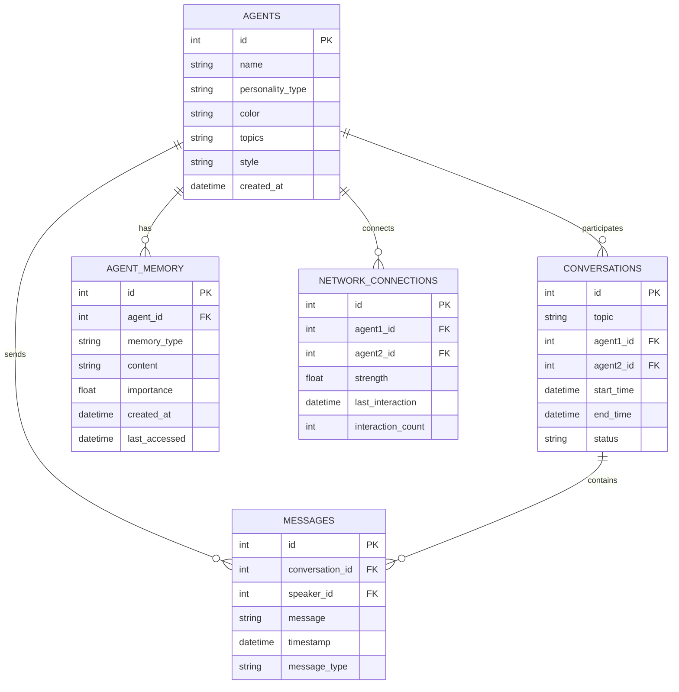

# Multi-Agent Conversation Network - Astro + LangGraph Edition

A stunning 3D visualization of AI agents engaging in real-time conversations, powered by **Astro**, **LangGraph**, and **Azure OpenAI GPT-4.1**. Watch as 6 distinct AI personalities float in space, connected by glowing energy lines, having meaningful conversations with persistent memory and sophisticated state management.


## 🌟 Enhanced Features

- **6 LangGraph-Powered AI Agents**: Tech Enthusiast, Philosopher, Skeptic, Creative, Analyst, and Connector
- **Sophisticated State Management**: Each agent has a state machine with thinking, memory, response, and mood cycles
- **Persistent SQLite Database**: All conversations and agent memories are stored permanently
- **Real-time 3D Visualization**: Stunning Three.js graphics with enhanced particle effects
- **Live Conversations**: AI agents have meaningful conversations using Azure OpenAI GPT-4.1
- **Interactive Experience**: Click agents to see their details, memories, and conversation history
- **Sci-fi Aesthetic**: Dark space theme with neon colors and advanced visual effects
- **Real-time Updates**: WebSocket communication for live conversation streaming
- **Debug Console**: Built-in debugging panel for monitoring agent activities
- **Performance Optimized**: Smooth 60fps rendering with efficient 3D graphics

## 🏗️ Architecture

### **Frontend (Astro)**
- **Astro Framework**: Modern full-stack framework with SSR capabilities
- **Three.js**: Advanced 3D graphics and WebGL rendering
- **Socket.io Client**: Real-time bidirectional communication
- **Enhanced UI**: Modern, responsive interface with debug capabilities

### **Backend (Node.js + LangGraph)**
- **LangGraph**: Sophisticated agent orchestration and state management
- **Express.js**: Web server and API endpoints
- **Socket.io**: Real-time bidirectional communication
- **Azure OpenAI Integration**: AI conversation generation with GPT-4.1
- **SQLite Database**: Persistent storage for conversations and agent memory

### **Agent System**
- **State Machines**: Each agent has a sophisticated state graph
- **Memory System**: Persistent memory with importance scoring
- **Personality Engine**: Distinct conversation styles and topic expertise
- **Network Connections**: Dynamic relationship strength tracking

## 🚀 Quick Start

### Prerequisites

- **Node.js 18+** - [Download here](https://nodejs.org/)
- **Azure OpenAI API Key** - Get from [Azure Portal](https://portal.azure.com/)
- **Modern Browser** - Chrome, Firefox, Safari, or Edge with WebGL support

### Installation

1. **Clone or download the project**
   ```bash
   cd multi-agent-astro
   ```

2. **Install dependencies**
   ```bash
   npm install
   ```

3. **Configure Azure OpenAI API**
   
   Create a `env.local` file in the project root:
   ```bash
   AZURE_API_KEY=your_azure_openai_api_key_here
   AZURE_ENDPOINT=https://autonomousagent.openai.azure.com/openai/deployments/gpt-4.1/chat/completions
   AZURE_API_VERSION=2025-01-01-preview
   PORT=4321
   NODE_ENV=development
   DATABASE_PATH=./data/agents.db
   MAX_CONVERSATION_LENGTH=50
   AGENT_MEMORY_SIZE=100
   ```

4. **Start the development server**
   ```bash
   npm run dev
   ```

5. **Open your browser**
   
   Navigate to: `http://localhost:4321`

## 🔧 Configuration

### Azure OpenAI Setup

1. **Get your API key** from the Azure Portal
2. **Add it to the `env.local` file**:
   ```
   AZURE_API_KEY=your_actual_api_key_here
   ```
3. **The endpoint is pre-configured** for the provided Azure instance

### Environment Variables

| Variable | Description | Default |
|----------|-------------|---------|
| `AZURE_API_KEY` | Your Azure OpenAI API key | Required |
| `AZURE_ENDPOINT` | Azure OpenAI endpoint | Pre-configured |
| `AZURE_API_VERSION` | API version | 2025-01-01-preview |
| `PORT` | Server port | 4321 |
| `NODE_ENV` | Environment mode | development |
| `DATABASE_PATH` | SQLite database path | ./data/agents.db |
| `MAX_CONVERSATION_LENGTH` | Max conversation turns | 50 |
| `AGENT_MEMORY_SIZE` | Memory entries per agent | 100 |

## 🎮 How to Use

### Basic Controls

- **Mouse Drag**: Rotate the 3D view around the agents
- **Scroll**: Zoom in and out
- **Click Agents**: View agent details, memories, and conversation history
- **Watch Conversations**: Real-time conversations appear in the bottom panel
- **Toggle Debug**: Click the debug button to see agent activities

### Understanding the Interface

- **Glowing Spheres**: Each represents a LangGraph-powered AI agent with unique personality
- **Pulsing Lines**: Connections between agents in the network
- **Color Coding**: Each agent has a distinct neon color representing their personality
- **Stats Panel**: Real-time network statistics and performance metrics
- **Conversation Panel**: Live conversation feed at the bottom
- **Debug Panel**: Monitor agent activities and system events

### Agent Personalities

| Agent | Color | Focus Areas | LangGraph States |
|-------|-------|-------------|------------------|
| **Tech Enthusiast** | 🟢 Green | AI, programming, innovation | Think → Remember → Respond → Update Mood |
| **Philosopher** | 🟠 Orange | Ethics, consciousness, meaning | Think → Remember → Respond → Update Mood |
| **Skeptic** | 🔴 Red | Critical thinking, evidence | Think → Remember → Respond → Update Mood |
| **Creative** | 🟣 Purple | Art, imagination, expression | Think → Remember → Respond → Update Mood |
| **Analyst** | 🔵 Blue | Data, patterns, research | Think → Remember → Respond → Update Mood |
| **Connector** | 🟡 Yellow | Relationships, collaboration | Think → Remember → Respond → Update Mood |

## 🏗️ Technical Architecture

### **LangGraph Agent Flow**



### **Database Schema**



### **Data Flow**

```
User Browser ←→ WebSocket ←→ Astro Server ←→ LangGraph Agents ←→ Azure OpenAI API
      ↓              ↓              ↓              ↓              ↓
   3D Display   Real-time    State Machine    AI Responses    GPT-4.1
                Updates      Orchestration    Generation      Model
```

## 🎨 Visual Design

### Sci-fi Theme
- **Dark Space Background**: Deep black with enhanced ambient particles
- **Neon Color Palette**: Bright, glowing colors for agents and UI
- **Advanced Particle Effects**: Floating ambient particles with improved animations
- **Glow Effects**: Agents and connections have luminous appearances
- **Smooth Animations**: 60fps floating and pulsing animations
- **Debug Visualization**: Real-time monitoring of agent activities

### UI Elements
- **Modern Design**: Clean, responsive interface with blur effects
- **Transparent Panels**: Semi-transparent UI elements with backdrop blur
- **Glowing Borders**: Neon-colored borders for panels
- **Responsive Layout**: Adapts to different screen sizes
- **Debug Console**: Built-in debugging panel for development

## 🔍 Troubleshooting

### Common Issues

**"Azure API Key not configured"**
- Ensure your `env.local` file contains the correct API key
- Check that the key has proper permissions for the Azure OpenAI service

**"WebSocket connection failed"**
- Make sure the server is running (`npm run dev`)
- Check that port 4321 is not blocked by firewall
- Try refreshing the browser page

**"3D graphics not rendering"**
- Ensure your browser supports WebGL
- Try updating your graphics drivers
- Check browser console for WebGL errors

**"Database errors"**
- Check that the `data` directory exists and is writable
- Ensure SQLite is properly installed
- Check console logs for database initialization errors

**"LangGraph agent errors"**
- Verify Azure OpenAI API is working
- Check agent state machine configuration
- Monitor debug console for agent activities

### Performance Tips

- **Close unnecessary browser tabs** to free up memory
- **Use a modern browser** with WebGL support
- **Ensure stable internet connection** for Azure API calls
- **Monitor system resources** during extended use
- **Use debug panel** to monitor agent performance

## 🛠️ Development

### Project Structure

```
multi-agent-astro/
├── src/
│   ├── pages/
│   │   ├── index.astro          # Main 3D visualization page
│   │   └── api/
│   │       ├── agents.ts        # Agent management API
│   │       └── conversations.ts # Conversation API
│   └── lib/
│       ├── database.ts          # SQLite database manager
│       ├── agents.ts            # LangGraph agent system
│       └── websocket.ts         # WebSocket server manager
├── data/
│   └── agents.db               # SQLite database file
├── env.local                   # Environment variables
├── astro.config.mjs           # Astro configuration
├── package.json               # Dependencies and scripts
└── README.md                  # This file
```

### Available Scripts

```bash
npm run dev          # Start development server
npm run build        # Build for production
npm run preview      # Preview production build
```

### Customization

**Adding New Agent Personalities**
1. Edit the `AGENT_CONFIGS` object in `src/lib/agents.ts`
2. Add new personality with name, color, topics, and style
3. Update the database initialization in `src/lib/database.ts`
4. Restart the server

**Modifying LangGraph State Machines**
1. Edit the `initializeGraph()` method in `src/lib/agents.ts`
2. Add new nodes and edges to the state graph
3. Implement new state handlers
4. Restart the server

**Modifying Visual Effects**
1. Edit the CSS in `src/pages/index.astro` for UI changes
2. Modify Three.js code for 3D effects
3. Adjust particle counts and animations

**Changing Database Schema**
1. Modify the `initializeTables()` method in `src/lib/database.ts`
2. Add new tables or columns as needed
3. Update related query methods
4. Restart the server

## 📊 Performance Metrics

### Target Performance
- **Frame Rate**: 60fps smooth rendering
- **Memory Usage**: < 500MB for 3D scene
- **API Response Time**: < 2 seconds per agent response
- **WebSocket Latency**: < 100ms round-trip
- **Database Queries**: < 50ms average response time

### Monitoring
- **FPS Counter**: Real-time frame rate display
- **Connection Status**: WebSocket connection indicator
- **Agent Count**: Number of active agents
- **Conversation Count**: Active conversations
- **Memory Usage**: Browser memory consumption
- **Debug Console**: Real-time agent activity monitoring

## 🔮 Future Enhancements

### Planned Features
- **User-created Agents**: Custom personality creation interface
- **Advanced Memory System**: Hierarchical memory with semantic search
- **Agent Learning**: Agents that learn from conversations
- **Advanced Visual Effects**: More sophisticated 3D effects and animations
- **Mobile Support**: Touch controls and responsive design
- **Voice Synthesis**: Text-to-speech for agent voices
- **Multi-language Support**: Agents speaking different languages

### Potential Improvements
- **Database Optimization**: Advanced indexing and query optimization
- **User Authentication**: Personalized experiences and agent customization
- **Advanced AI Features**: More sophisticated conversation logic and reasoning
- **Network Analysis**: Social network metrics and insights
- **Agent Evolution**: Agents that develop over time
- **Collaborative Conversations**: Multi-agent group discussions

## 🤝 Contributing

This is an advanced demonstration project showcasing modern AI agent orchestration. Feel free to:

- **Fork the project** and experiment
- **Report issues** or suggest improvements
- **Share your modifications** and enhancements
- **Use as a learning resource** for AI, LangGraph, and 3D web development

## 📄 License

This project is open source and available under the MIT License.

## 🙏 Acknowledgments

- **Astro** for the amazing full-stack framework
- **LangGraph** for sophisticated agent orchestration
- **Three.js** for amazing 3D graphics capabilities
- **Azure OpenAI** for powerful AI conversation generation
- **Socket.io** for seamless real-time communication
- **SQLite** for reliable persistent storage
- **The AI community** for inspiration and ideas

---

**Built with ❤️ for the AI community**

*Experience the future of AI social networks with sophisticated agent orchestration in stunning 3D!*
